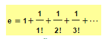

# Ejercicio 3: Ciclos

> Primera Parcial

- FACULTAD DE TELEMATICA
- INGENIERÍA EN SOFTWARE
- “3ºG”
- ESTRUCTURA DE DATOS
- CATEDRATICO: RAMIREZ GONZALEZ HUMBERTO
- AGUIRRE ROMERO RAMÓN ALEJANDRO

## OBJETIVO

Resolver las funciones necesarias para implementar las series que ayuden a aproximar los valores de e

> ENTREGA: LUNES 30 DE AGOSTO DEL 2021

## EXPLICACIÓN DEL PROCESO

Resolver las funciones necesarias para implementar las series que ayuden a aproximar los valores de e y la que viene abajo..
Estos ejercicios se pueden resolver como funciones recibiendo los parámetros necesarios.
Anexo las series de e en imagen.
Además resolver la siguiente serie infinita

> S= 4 + (4/3) - (4/5) + (4/7) - (4/9) + (4/11) - (4/13) + (4/15) - (4/17) .....

En los 2 casos se trata de series infinitas, por lo que ustedes deberían poner un limite en cada una de ellas

Se puede usar por ahora un repositorio común donde solo suban el archivo con el código de las series y su correspondiente llamada, no deben imprimir los valores parciales, solo el resultado final.

